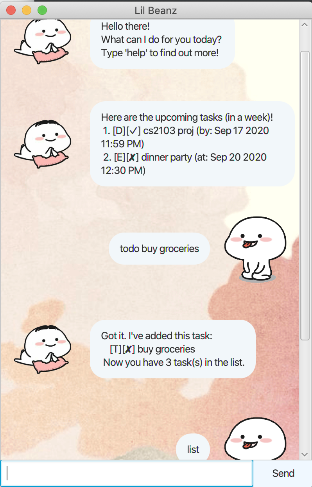

# User Guide
Duke is a desktop app for managing tasks, optimized for use via a Command Line Interface (CLI) while still 
having the benefits of a Graphical User Interface (GUI)

Table of contents
- [Quick Start](#quick-start)
- [Features](#features)
    * [Viewing help: `help`](#1-viewing-help-help)
    * [Adding a task](#2-adding-a-task-tododeadlineevent)
        * [To Do: `todo`](#21-todo-task-todo)
        * [Deadline: `deadline`](#22-deadline-task-deadline)
        * [Event: `event`](#23-event-task-event)
    * [Listing all tasks: `list`](#3-listing-all-tasks-list)
    * [Listing upcoming tasks: `upcoming`](#4-listing-upcoming-tasks-upcoming)
    * [Finding tasks by keyword: `find`](#5-finding-tasks-by-keyword-find)
    * [Marking a task as done: `done`](#6-marking-a-task-as-done-done)
    * [Deleting a task: `delete`](#7-deleting-a-task-delete)
    * [Exiting the program: `bye`](#8-exiting-the-program-bye)
    * [Saving the data](#9-saving-the-data)

## Quick start

1. Ensure you have Java `11` or above installed in your Computer.

1. Download the latest `duke.jar` from [here](https://github.com/constancensq/ip/releases).

1. Copy the file to the folder you want to use as the _home folder_ for your Duke chatbot.

1. Double-click the file to start the app. The GUI similar to the below should appear in a few seconds. Note how the app contains some sample data.<br>

   

1. Type the command in the command box and press Enter to execute it. e.g. typing **`help`** and pressing Enter will open the help window.<br>
   Some example commands you can try:

   * **`list`** : List all tasks.

   * **`todo`**`study hard` : Adds a todo task named `study hard` to the Duke chatbot.

   * **`delete`**`3` : Deletes the 3rd task shown in the current list.

   * **`bye`** : Exits the app.

1. Refer to the [Features](#features) below for details of each command.
## Features 

### 1. Viewing help: `help`
Shows a message listing all commands and how to use them.

Format: `help`

Example of usage: 
```
help
```

Expected outcome: 
```
Here are the things that I can do for you! 

- Add a todo task:
  todo <task description>

- Add an event task:
  event <task description> /at <task timing (yyyy-mm-dd HH:MM)>

- Add a deadline task:
  deadline <task description> /by <task timing (yyyy-mm-dd HH:MM)>

- See list of tasks:
  list

- Mark a task as done:
  done <number>

- Delete a task:
  delete <number>

- Find tasks with a keyword:
  find <keyword>

- End this program :d :
  bye
```

### 2. Adding a task: `todo/deadline/event`
#### 2.1 Todo task: `todo`
Adds a todo task to the chatbot. 

Format: `todo <task description>`

Example usage: 
```
todo study cs2103
```

Expected outcome: 
```
Got it. I've added this task:
    [T][✘] study cs2103
Now you have 1 task(s) in the list.
```

#### 2.2 Deadline task: `deadline`
Adds a deadline task to the chatbot. 

Format: `deadline <task description> /by <task timing (yyyy-mm-dd HH:MM)>`

Example usage: 
```
deadline cs2103 proj /by 2020-09-17 23:59
```

Expected outcome:
```
Got it. I've added this task:
    [D][✘] cs2103 proj (by: Sep 17 2020 11:59 PM)
Now you have 2 task(s) in the list.
```

#### 2.3 Event task: `event`
Adds an event task to the chatbot. 

Format: `event <task description> /at <task timing (yyyy-mm-dd HH:MM)>`

Example usage: 
```
event dinner party /at 2020-09-20 12:30
```

Expected outcome: 
```
Got it. I've added this task:
    [E][✘] dinner party (at: Sep 20 2020 12:30 PM)
Now you have 3 task(s) in the list.
```

### 3. Listing all tasks: `list`
Shows a list of all tasks saved in the chatbot.

Format: `list`

Example usage:
```
list
```

Expected outcome: 
```
Task(s) in your list:
 1. [T][✘] study cs2103
 2. [D][✘] cs2103 proj (by: Sep 17 2020 11:59 PM)
 3. [E][✘] dinner party (at: Sep 20 2020 12:30 PM)
```

### 4. Listing upcoming tasks: `upcoming`
Shows a list of all deadline/event tasks in a week saved in the chatbot.

Format: `upcoming`

Example usage: 
```
upcoming
```
Expected outcome: 
```
Here are the upcoming tasks (in a week)!
 1. [D][✘] cs2103 proj (by: Sep 17 2020 11:59 PM)
 2. [E][✘] dinner party (at: Sep 20 2020 12:30 PM)
```

### 5. Finding tasks by keyword: `find`
Shows a list of all tasks that contains the given keyword.

Format: `find <keyword>`

Example usage:
```
find cs2103
```

Expected outcome: 
```
Found some matching tasks:
 1. [T][✘] study cs2103
 2. [D][✘] cs2103 proj (by: Sep 17 2020 11:59 PM)
```

### 6. Marking a task as done: `done`
Marks the specified task as done.

Format: `done <task number>`

Example usage: 
```
done 1
```
Expected outcome: 
```
Ok! I've marked this task as done:
    [T][✓] study cs2103
```

### 7. Deleting a task: `delete`
Deletes the specified task from the chatbot.

Format: `delete <task number>`

Example usage: 
```
delete 1
```

Expected outcome: 
```
No problem. I've removed this task:
    [T][✓] study cs2103
 Now you have 2 task(s) in the list.
```

### 8. Exiting the program: `bye`
Exits the program.

Format: `bye`

Example usage: 
```
bye
```

Expected outcome: 
```
Goodbye! Come back soon!
```

### 9. Saving the data
Duke's data are saved in the hard disk automatically after any commands that changes it.
There is no need to save the data manually. 